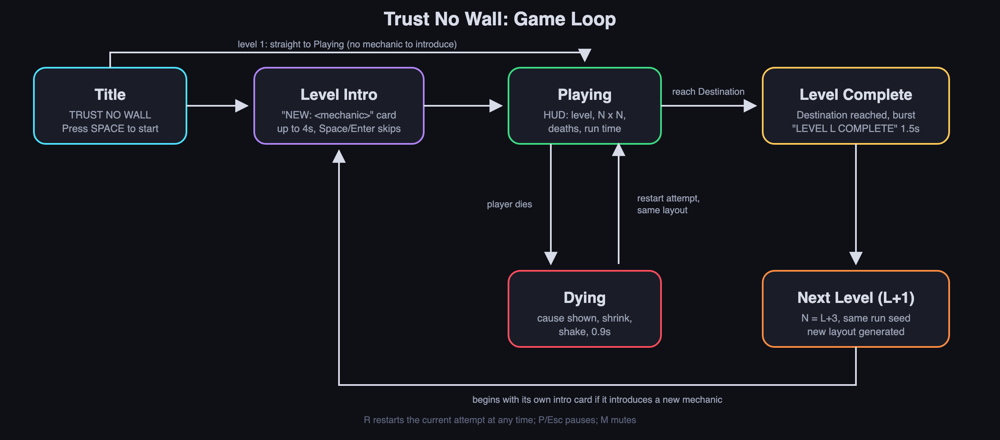
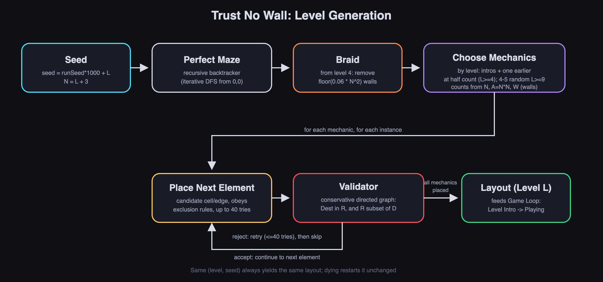

# Trust No Wall: Descriptive Document

Team 7: Qiming Xiao, Manas Vardhan

- **Play online:** https://csci-526.github.io/Team7-trust-no-walls/
- **Gameplay video:** https://drive.google.com/file/d/108_E55riLKDuFTiWyroH48iHKu0jDZD_/view?usp=sharing
- **Repository:** https://github.com/CSCI-526/Team7-trust-no-walls

## Logline (Genre + Twist)

A 2D top-down maze game where the maze itself lies to you: walls hide, move, vanish and rewire, but every lie follows a learnable rule (Maze + Deceptive, Changing Maze).

## Genre tropes research and twist

### Research: three maze games

- **Pac-Man** (Namco, 1980). The player navigates a fixed, fully visible maze, collecting pellets while avoiding four ghosts, each with its own movement pattern. The maze never changes; mastery comes from learning the ghosts, not the maze.
- **Maze Craze: A Game of Cops 'n Robbers** (Atari 2600). Two players race through a randomly generated top-down maze. Optional variants add novelty rules, such as a maze that is invisible and only briefly revealed, but these are side modes on an otherwise honest maze.
- **Level Devil** (Unept (Adam Corey), 2023). A trial-and-error game where floors become spikes and platforms vanish when you commit. The level deceives the player, who progresses by dying, memorizing and retrying, with no warning on a first attempt and no guarantee a trap is fair.

### Shared tropes

1. The maze is a stable, observable puzzle: what you see is the truth, and skill means reading the layout.
2. Hidden or false information, when present, is an optional side mode, not the core of play.
3. When deception is the whole point (Level Devil), there is no fairness guarantee or rule to learn from.
4. Failing restarts the same challenge; only the player's knowledge improves.
5. Simple directional movement, a clear start and goal, and difficulty that rises through bigger layouts and more threats.

### Twist and justification

**Twist:** the maze itself is deceptive and changing (invisible walls, sliding and disappearing walls, trigger plates that rewire walls, a decoy goal, a shadow that follows your trail), yet every level is checked to be solvable and every lie follows a fixed, telegraphed rule.

**Why it is innovative:** it **subverts** tropes 1 and 2 by making deception the constant condition of the whole game instead of an optional mode on an honest maze. It **combines** Maze Craze's hidden-maze idea with Level Devil's committed deception, but applies it to maze navigation instead of platforming. It fixes trope 3's weakness with a solvability guarantee and visible tells (a wall flashes before it moves, plates share a color with their walls, memory tiles reveal hidden walls, the real goal's star spins while a decoy's does not). It deliberately keeps trope 4: dying restarts the same layout, so remembering the maze's specific lies becomes the skill.

## Short prototype description

The player steps through a top-down grid maze from a Start pad to a Destination star, and the maze grows by one cell in each dimension every level (4 x 4 on level 1). As levels progress, new obstacles that deceive or change the maze unlock: invisible walls, sliding and disappearing walls, collapsing floors, trigger plates that rewire walls, teleporters, rotating gates, patrols, one-way paths, a decoy goal and a shadow that follows the player's trail. Because each obstacle follows a fixed rule and dying restarts the same layout, the player must observe, time and remember the maze's tricks instead of simply reading its map.

**Controls:** WASD or Arrow keys move one cell per step (hold to keep moving); Space or Enter starts and skips intro cards; R restarts the attempt; P or Esc pauses; M mutes; F2 toggles a demo autopilot.

## Twist and Mechanics Matrix (core mechanic)

| Mechanics | Description | Interaction with Twist | Affected Genre Elements | Type of Genre Innovation | Supports |
|---|---|---|---|---|---|
| Deceptive, Changing Maze (core mechanic) | The maze's walls and floor hide, move, vanish and rewire according to fixed, telegraphed rules while the player navigates from Start to Destination. | It is the twist: the player cannot trust the visible map and must learn each rule, and dying restarts the same layout so every lie can be learned. | Maze layout, walls, navigation, the goal, the retry loop | Subversion, Combination | Exploration, timing, memory |

## Level progression

| Level | Maze | New obstacles |
|---|---|---|
| 1 | 4 x 4 | None: basic maze |
| 2 | 5 x 5 | Invisible Walls, Memory Tiles |
| 3 | 6 x 6 | Moving Walls, Disappearing Walls |
| 4 | 7 x 7 | Collapsing Tiles, Trigger Walls (+ one earlier obstacle) |
| 5 | 8 x 8 | Teleporters, Rotating Gates (+ one earlier obstacle) |
| 6 | 9 x 9 | Patrols, One-Way Paths (+ one earlier obstacle) |
| 7 | 10 x 10 | Decoy Destination (+ one earlier obstacle) |
| 8 | 11 x 11 | Chasing Shadow (+ one earlier obstacle) |
| 9+ | 12 x 12 and up | 4 random obstacles per level (5 from level 12) |

## Individual contributions

- **Qiming Xiao:** Game concept and design direction (maze + deceptive-maze twist), genre research on Pac-Man, Maze Craze and Level Devil, design of the obstacle set and level progression, playtesting and difficulty feedback, the descriptive document, and the gameplay video.
- **Manas Vardhan:** Unity implementation: procedural maze generation and the solvability validator, the level simulation for all obstacles, rendering, animations, HUD, audio and game flow, the demo autopilot and automated tests, and the WebGL build hosted on GitHub Pages.

## Diagrams

**Figure 1. Game loop.**

**Figure 2. Level generation.** Each obstacle is kept only if the validator confirms the level stays completable with no traps.

